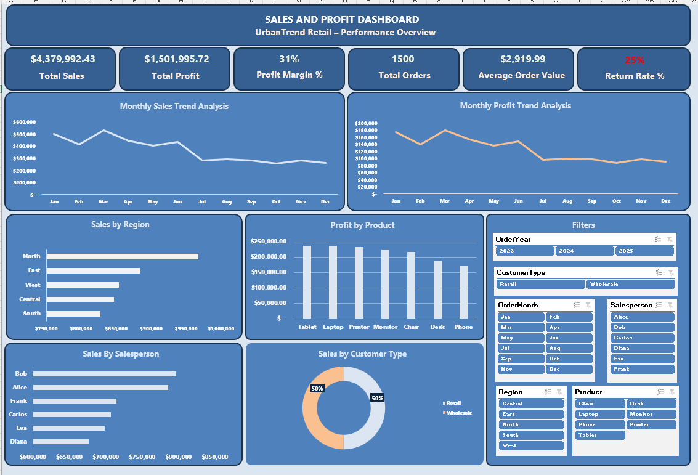

# Excel Sales & Profit Dashboard

This Excel project analyzes product and regional performance using pivot tables, charts, and KPI summaries.

---

## 🔧 Steps Performed

- Cleaned raw dataset (removed blanks, standardized categories)
- Created pivot tables for:
  - Sales by Region
  - Profit by Product
  - Monthly Sales Trend
- Built KPI cards:
  - Total Sales
  - Total Profit
  - Profit Margin %
  - Average Order Value
- Designed a clean, business‑friendly dashboard layout

---

## 📊 Dashboard Highlights

- The **North Region leads total sales**, showing consistently strong performance across all months.
- **Tablets and Laptops generate the highest profit**, making them the most profitable product categories.
- **Sales and profit decline steadily from March to October**, indicating a seasonal drop in demand.
- **Bob is the top-performing salesperson**, maintaining the highest sales across all months.

---

## 📸 Screenshots

 

---

## 📁 Files Included

- [Sales_data.xlsx](Product-Sales-Region.csv.xlsx)
- [cleaned_data.xlsx](Product-Sales-Region.xlsx)

