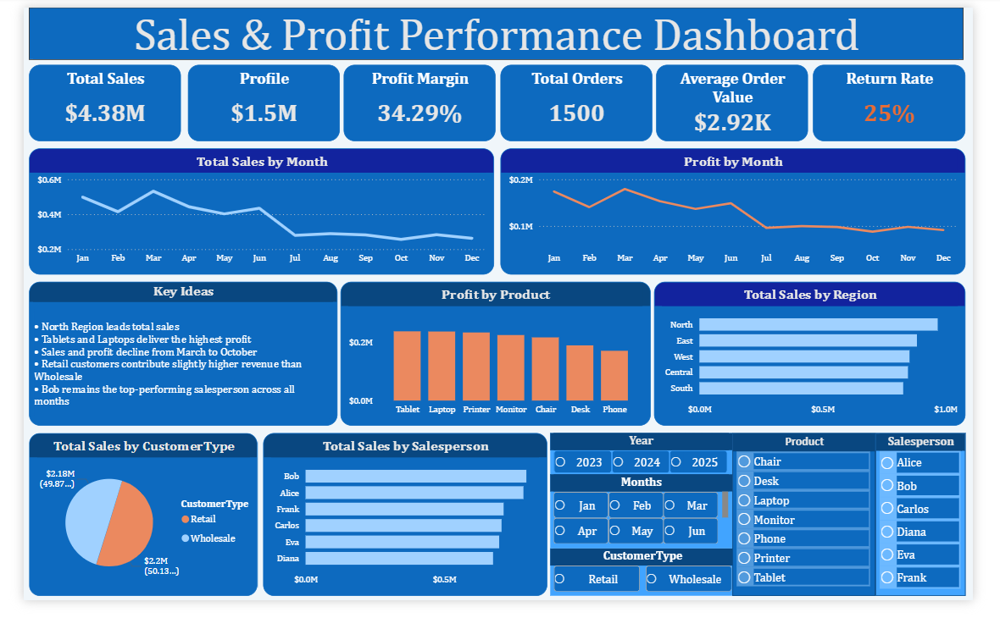

# Power BI Dashboard – Product, Sales & Region Analytics

This Power BI dashboard visualizes key insights from the Product–Sales–Region dataset.  
It highlights sales performance, profit trends, customer behavior, and operational metrics such as delivery time.

---

## 📌 Dashboard Overview

The dashboard provides an interactive view of:

- Monthly Sales Trend  
- Monthly Profit Trend  
- Top 5 Products by Profit  
- Sales by Salesperson  
- Sales by Customer Type  
- Sales by Region 

These visuals help identify performance patterns, customer behavior, and operational efficiency.

---

## 🗂 Data Source

The dashboard uses the cleaned dataset prepared in:

- **Excel Project** (data cleaning & formatting)  
- **SQL Project** (transformations & analysis queries)

Final dataset was imported into Power BI for visualization.

---

## 🔧 Calculated Columns (Created in Power BI)

The following calculated columns were created to support time intelligence and cost analysis:
 
- **Year** – Extracted from order date  
- **Month Name** – Full month name for trend visuals  

These columns improve filtering, grouping, and time‑based analysis.

---

## 🧮 Key Measures (DAX)

The dashboard uses the following DAX measures:

- **Total Sales** = SUM(Profit)
- **Profit** = Total Sales – Cost - ShippingCost 
- **Profit Margin %** = DIVIDE(Profit, Total Sales)  
- **Average Order Value (AOV)** = DIVIDE(Total Sales, Total Orders)  
- **Total Orders** = DISTINCTCOUNT(OrderID)  
- **Return Rate** = DIVIDE(Returned Orders, Total Orders)  

These measures help evaluate financial performance and customer behavior.

---

## ⭐ Key Insights (Dashboard Highlights)

- **North Region leads total sales**, showing consistently strong performance.  
- **Tablets and Laptops deliver the highest profit**, making them the most valuable product categories.  
- **Sales and profit decline from March to October**, indicating a seasonal slowdown.  
- **Retail customers contribute slightly higher revenue than wholesale customers**, showing stronger direct‑to‑consumer performance.  
- **Bob remains the top‑performing salesperson across all months**, consistently outperforming peers.  

These insights help identify growth opportunities and operational improvements.

---

## 🧩 Data Model

This project uses a **single-table model**:

- `productSalesRegion` (combined dataset containing all fields)  

Additional calculated columns created in Power BI:

- `Cost`  
- `Year`  
- `Month Name`  

---

## 📊 Key Visuals Included

- **Line Chart:** Monthly Sales Trend  
- **Line Chart:** Monthly Profit Trend  
- **Column Chart:** Top 5 Products by Profit  
- **Bar Chart:** Sales by Salesperson  
- **Pie Chart:** Sales by Customer Type  
- **Bar Chart:** Sales by Region  
- **Card KPIs:** Total Sales, Total Profit, Total Orders , AOV, Profit Margin, Return Rate    

---

## 📸 Screenshots

---

## 📁 Files Included

- `dashboard.pbix` – Power BI report file  
- `README.md` – Documentation for the Power BI project  

---

## ✅ Summary

This Power BI dashboard provides a clear, interactive view of sales, profit, customer behavior, and operational performance.  
It complements the Excel and SQL components of the Product–Sales–Region Analytics project.

